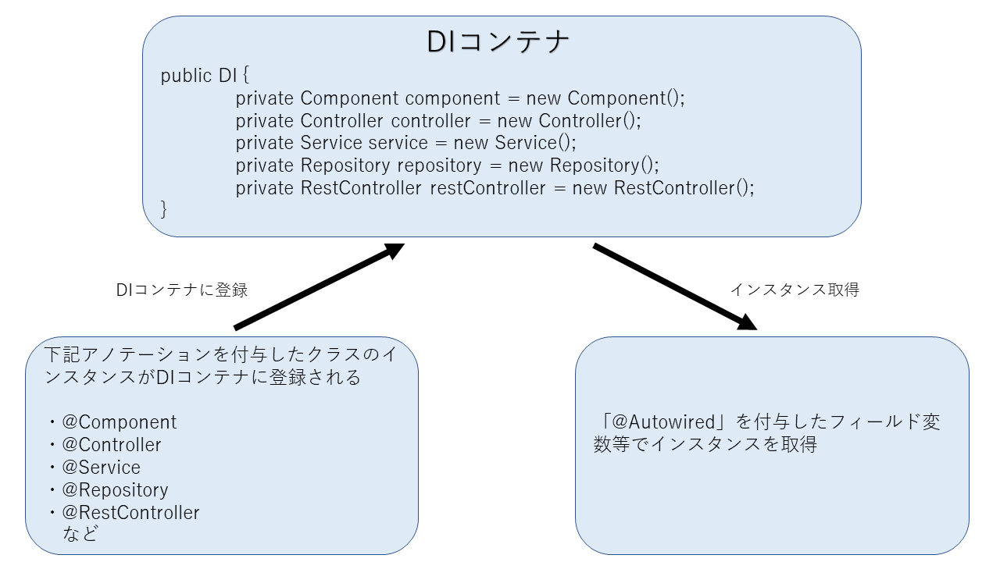

# DI を理解する <!-- omit in toc -->

- [1. DI とは何か](#1-di-とは何か)
- [2. DI によって実現できること](#2-di-によって実現できること)
- [3. DI の対象となるアノテーション](#3-di-の対象となるアノテーション)
- [4. DI の使用例](#4-di-の使用例)
  - [4.1. SampleService.java](#41-sampleservicejava)
  - [4.2. SampleController.java](#42-samplecontrollerjava)
  - [ポイント](#ポイント)

## 1. DI とは何か

「Dependency Injection」の略であり、日本語にすると「依存性の注入」とよく表現されます。

## 2. DI によって実現できること

<span class="red">特定のアノテーション</span>を付与したクラスのインスタンスを<span class="red">「@Autowired」</span>によって、他のクラスの変数や引数に代入して使用することができます。

その他、「@Scope」によってインスタンスのライフサイクル（リクエストスコープ、セッションスコープ等）を管理しているが、まずは「@Autowired」を使えるようになりましょう。



## 3. DI の対象となるアノテーション

- <span class="red">@Component</span>
- <span class="red">@Controller</span>
- <span class="red">@Service</span>
- <span class="red">@Repository</span>
- <span class="red">@RestController</span>
- @ControllAdvice
- @ManageBean
- @Named

## 4. DI の使用例

「@Service」を付与した SampleService クラスを作成し、SampleController クラスで「@Autowierd」を付与して DI します。

### 4.1. SampleService.java

```java
package com.example.service;

import org.springframework.stereotype.Service;

//ポイント①
@Service
public class SampleService {
    public String outputHello() {
        return "Hello";
    }
}
```

### 4.2. SampleController.java

```java
package com.example.controller;

import org.springframework.beans.factory.annotation.Autowired;
import org.springframework.web.bind.annotation.GetMapping;
import org.springframework.web.bind.annotation.RestController;

import com.example.service.SampleService;

//ポイント②
@RestController
public class SampleController {
    //ポイント③
    @Autowired
    SampleService sampleService;

    @GetMapping
    String getHello() {
        //ポイント④
        return sampleService.outputHello();
    }
}
```

### ポイント

1. SampleService クラスに「<span class="red">@Service</span>」を付与して <span class="red">DI 対象のクラス</span>に設定
   「Hello」という文字列を返す「outputHello()メソッド」を作成しておく

2. SampleController クラスに「<span class="red">@RestController</span>」を付与し、戻り値でテキストコンテンツを返すように設定
   ※「@Controller」を付与して、画面に表示させる HTML ファイルを作成しても良いが、今回は DI によって SampleService クラスのメソッドが SampleController クラスで使用できることを確かめるだけなので、「@RestController」を使用した

3. 「<span class="red">@Autowired</span>」により<span class="red">「SampleService」型の インスタンスを「sampleService」という変数</span>に代入

4. SampleService クラスの「outputHello()メソッド」を使用し、「localhost\:8080」でアクセスした際に、画面に戻り値「Hello」を表示させる

プロジェクトを起動させ、「localhost\:8080」にアクセスして「Hello」が表示されていることを確認
