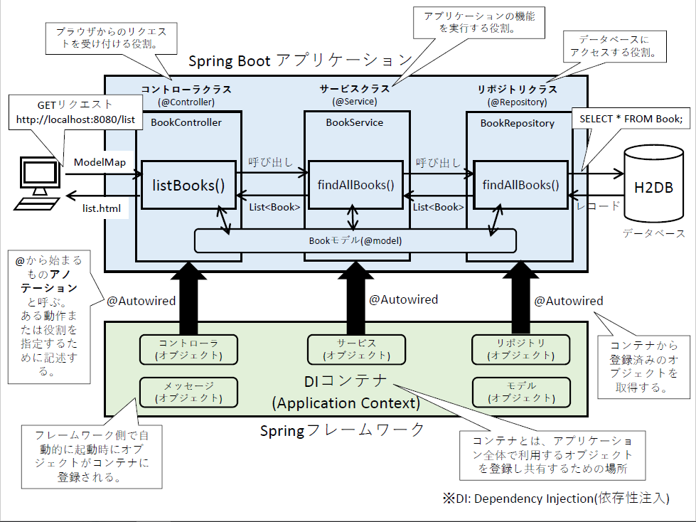

## Spring Bootアプリケーションの仕組み
ここでは、実際にSpring Bootアプリケーションが動作する仕組みについて説明する。
動作の概要図を以下に示す。



アプリケーションを構成する要素として、モデル、ビュー、コントローラ、サービス、リポジトリの5つがある。モデル、ビュー、コントローラについては、冒頭で説明したMVCの役割と同等である。リクエストを受け付けてからレスポンスを返すまでの流れとしては、コントローラ→サービス→リポジトリ→サービス→コントローラの順である。

以降は、アプリケーションがブラウザからのアクセスを受け付けてからブラウザに画面を返すまでの順序で、各要素の役割やプログラムを解説する。

### コントローラ
コントローラの役割は、ブラウザからのリクエストを受け付け、そのリクエストに適した機能を呼び出しその結果をブラウザ側に返すことである。ここでは、``/system/controller/BookController.java``の書籍一覧表示を例に説明する。

クラス定義(``public class BookController``)の上に``@Controller``アノテーションを付与することでフレームワークにコントローラクラスであることを認識させる。

```java
@Controller
@RequestMapping("/")
public class BookController {

	/**
	 * 書籍サービス(コンテナよりサービスオブジェクトを取得)
	 */
	@Autowired
	BookService service;

	/**
	 * 一覧画面にアクセスしたとき
	 * @param search タイトル検索用のキーワード
	 * @param model 画面に表示するためのビューモデル
	 * @return 画面
	 */
	@GetMapping({"/", "/list"})
	public String listBooks(TitleSearch search, ModelMap model) {
		// サービスより、書籍を全件取得する。
		List<Book> books = service.findAllBooks();
		// サービスから取得した書籍リストを画面に設定する。
		model.addAttribute("books", books);
		// 一覧画面を返却する。
		return "list";
	}
}
```

ブラウザより``http://localhost:8080/``にアクセスすると、下記プログラム上の``listBooks()``メソッドが呼び出される。Spring Bootでは、アノテーションによりリクエストを受け付けた時に呼び出されるメソッドを指定できる。今回のアクセスはGETリクエストで``/``にアクセスしているため、``@GetMapping({"/", "/list"})``が指定されている``listBooks()``メソッドが呼び出される(先頭の``http://localhost:8080``は省略して記載する)。上記の指定の仕方の場合、``http://localhost:8080/list``でも``listBooks()``メソッドが呼び出される。

``listBooks()``メソッドの引数には、``TitleSearch``クラスと``ModelMap``クラスのオブジェクトが指定されている。``ModelMap``クラスのオブジェクトは、ブラウザ上に入力されたデータやアプリケーション側から返すデータを入れるオブジェクトである。今回のアクセスの場合、リクエストパラメータが含まれてないためこのオブジェクトには何もデータは入っていない。

``listBooks()``メソッド内の処理としては、サービスクラスより書籍一覧を取得し画面に返却している。``service.findAllBooks()``より、``BookService``クラスの``findAllBooks()``を呼び出している。serviceインスタンスは、アプリケーション起動時にコンテナに登録されており、コンテナに登録されているserviceインスタンスを``@Autowired``により取得している。このことを **依存性注入(DI: Dependency Injection)** と呼ぶ。サービス側の処理については、後述する。

取得した書籍一覧を``ModelMap``クラスのオブジェクト``model``に設定している。この``model``に設定したデータがビュー側で表示できる。最後に、表示する画面のファイル名``list``を指定し返却している。その後、フレームワーク側にて``list.html``を利用したレンダリング処理が実行される。

### サービス
サービスの役割は、処理を実施するにあたって必要なデータをデータベースから取得し実施しその結果をコントローラに返すことである。ここでは、``system/service/BookService.java``の書籍一覧表示を例に説明する。

クラス定義(``public class BookService``)の上に``@Service``アノテーションを付与することでフレームワークにサービスクラスであることを認識させる。

```java
@Service
@Transactional
public class BookService {

  /**
   * 書籍リポジトリ(コンテナよりオブジェクトを取得)
   */
  @Autowired
  private BookRepository repo;

  /**
   * 書籍情報を全件取得する。
   * @return 書籍リスト
   */
  public List<Book> findAllBooks() {
    // リポジトリより、書籍データを全件取得する。
    return repo.findAll();
  }
}
```

``findAllBooks()``メソッド内の処理としては、データベースアクセスの役割を持つリポジトリに書籍データを全件取得するメソッド(``repo.findAll()``)を呼び出しその結果を返却している。repoインスタンスは、アプリケーション起動時にコンテナに登録されており、コンテナに登録されているrepositoryインスタンスを``@Autowired``により取得している。

### リポジトリ
リポジトリの役割は、データベースに問い合わせデータを取得し、レコードセットをJavaオブジェクトに変換して返すことである。ここでは、``/system/repository/BookRepository.java``の書籍一覧表示を例に説明する。

クラス定義(``public class BookRepository``)の上に``@Repository``アノテーションを付与することでフレームワークにリポジトリクラスであることを認識させる。

```java
@Repository
public class BookRepository {
  /**
   * 全件検索用SQL
   */
  private static final String FIND_ALL_SQL = "SELECT * from Book";

  @PersistenceContext(unitName = "entityManagerFactory")
  private EntityManager entityManager;

  /**
   * 書籍を全件検索する
   * @return 書籍リストオブジェクト
   */
  public List<Book> findAll() {
    // SQLを定義
    Query query = entityManager.createNativeQuery(FIND_ALL_SQL, Book.class);
    // SQLを実行し、複数件データを取得する。
    return query.getResultList();
  }
}
```

このクラスで定義されている``EntityManager``クラスは、データベースにSQLを実行して結果を取得するために利用するクラスである。このクラスは、JPA(Java Persistence API)と呼ばれるライブラリに含まれる。``EntityManager``クラスのインスタンスもコンテナ管理されているため、``@PersistenceContext``アノテーションによりインスタンスを取得している。フレームワーク上の仕様により、``@Autowired``ではなく``@PersistenceContext``を利用している。

``findAll()``メソッドでは``createNativeQuery()``メソッドでクエリを生成し、複数件データを取得できる``getResultList()``メソッドで結果を取得する。SQLのレコードからJavaのオブジェクトに変換する処理は、このEntityManager内で自動的に実施されるため実装は不要である。EntityManagerクラスには上記以外にも複数のメソッドを持っている。以下にその一部を示す。

|メソッド名|返戻型|概要|
|:---:|:---:|:---|
|``getSingleResult()``|Object|SQLにより取得した結果を **1件** 取得する。|
|``getResultList()``|List|SQLに取得した結果を **複数件** 取得する。|
|``executeUpdate()``|void|SQLを実行しデータベースのデータを更新する。|
|``createNativeQuery(String sql)``|Query|引数で指定したSQLを実行する。|

また、SQL内でパラメータ(引数)を指定したい場合は次のようにサーブレットの実装と類似した形で実装できる。例えば、下記のようなテーブルおよびモデル用いて1件取得したい場合は次ように記述する。

**商品テーブル(Product)**

|物理名|論理名|型|桁数|必須|備考|
|:---|:---|:---|:---:|:---:|:---|
|id|商品ID|bigint|-|○|主キー、自動採番|
|name|商品名|varchar|256|-||
|kana|商品名カナ|varchar|256|-||
|price|単価|varchar|256|-||

**Product.java(getter, setterを省略)**
```java
public class Product {
    private long id;
    private String name;
    private String kana;
    private String price;
    
    public long getId() {
        return this.id;
    }
    
    public void setId(String id) {
        this.id = id;
    }
}
```

**リポジトリクラスの実装**
```java
private static final String FIND_BY_ID_SQL = "SELECT * from Product WHERE id = ?1";

public Product findById(long id) {
  // SQLを定義
  Query query = entityManager.createNativeQuery(FIND_BY_ID_SQL, Product.class);
  // 定義したSQLの1番目の引数に、idを設定する
  query.setParameter(1, id);
  // SQLを実行し、1件データを取得する。
  return (Product) query.getSingleResult();
}
```

SQLにパラメータを設定するときは、値が変動するパラメータ部分を``?``とする。``?``の後の番号はパラメータの位置を表しており、前から何番目のパラメータなのかを示している。ここでは一番目なので``?1``としている。実際にパラメータを設定するプログラム(``query.setParameter(1, id);``)にて、1番目の引数に何番目のパラメータなのかを指定している。

### モデル
モデルは、データベースのテーブル **1行分のデータ** を表す。書籍テーブルは、下記のような定義となっているため、次のように書籍テーブルに対応したモデルクラスを用意している。

|物理名|論理名|型|桁数|必須|備考|
|:---|:---|:---|:---:|:---:|:---|
|id|書籍ID|bigint|-|○|主キー、自動採番|
|title|書籍タイトル|varchar|256|○||
|publisher|出版社名|varchar|256|○||
|price|価格|varchar|256|○||
|isbn|ISBN13|varchar|256|○||

```java
@Entity
public class Book {

	/** ID ： Hibernateによる自動採番 */
	@Id
	@GeneratedValue(strategy = GenerationType.IDENTITY)
	private long id;

	/** 書籍タイトル : 1文字以上、30文字以下 */
	@Size(min=1, max=30)
	private String title;

	/** 出版社名 : 1文字以上、10文字以下 */
	@Size(min=1, max=10)
	private String publisher;

	/** 価格 : 1文字以上、9文字以下 */
	@Pattern(regexp = "^[0-9]{1,9}$")
	private String price;

	/**
	 * ISBN : 13文字以上、17文字以下
	 * 	半角数字と-(ハイフン)のみ入力可能
	 */
	@Size(min=1, max=30)
	private String isbn;

	/** デフォルトコンストラクタ */
	public Book() {
	}
}
```

書籍モデルのIDは、Hibernateというライブラリを通じて自動採番させている。これは、データベースにおける``AUTO_INCREMENT``と同じ意味である。

また、タイトルや出版社名、ISBNといった項目には文字数制限があるため(こちらの[仕様](./system.md)を参照のこと)、アノテーション(``@Size(min=1, max=30)``)により文字サイズを指定している。``min``に最小桁数、``max``に最大桁数を設定する。

価格は文字数制限に加えて半角数字でなければならない。この制限は、正規表現を利用して検証している。正規表現とは、対象の文字列が期待している文字列の形式と合致しているか検証するための仕組みであり、文字列の形式を正規表現特有の言語によって指定する。今回は半角数字で1文字以上、9文字以下という条件であるため、これを正規表現で表現している。``^[0-9]{1,9}$``の``^``(ハット)は文字列の先頭を表し、``[0-9]``は0から9までの文字列のみ入ることを示している。さらに、``{1, 9}``は1文字以上9文字以下であることを表している。よって、「文字列の先頭から半角数字の0～9までの文字が1文字以上9文字以下繰り返される文字列」ということを表現している。これで当初の条件を見させることが理解できる。

このモデルクラスでは上記以外にも、各メンバ変数のgetterとsetterを定義している。こちらは、サービスクラスやコントローラクラスにてモデルの値を取得したり、設定したりする際に用いるものである。

### ビュー
ビューの役割は、ユーザの操作を受け付け、操作内容によってはコントローラに操作内容を伝えることである。
Webアプリケーションの場合、ビューはHTMLとCSSを用いて作成する。HTMLとCSSについての解説は、[HTML/CSS](./htmlcss.md)を参照のこと。
ここではSpring Boot側から返却されたデータを表示するための仕組みとして、「Thymeleaf」を利用する。一覧画面(``\src\main\resources\templates\list.html``)を例に記述方法を説明する。

**Bodyタグ内を一部掲載**
```html
<!-- ナビゲーションバー -->
<div class="ui grid">
  ・・・・
</div>

<!-- コンテンツ -->
<div class="main ui container">
  <!-- 検索ボックス -->
  ・・・・

  <!-- 検索結果一覧 -->
  <table class="ui selectable striped table">
    <thead>
      <tr>
        <th>書籍ID</th><th>書籍タイトル</th><th>出版社名</th><th colspan="2">操作</th>
      </tr>
    </thead>
    <tbody>
      <tr th:each="book : ${books}">
        <td th:text="${book.id}">ID</td>
        <td><a th:href="@{/detail-{id}-book(id=${book.id})}" th:text="${book.title}"></a></td>
        <td th:text="${book.publisher}">Publisher</td>
        <td>
          <a th:href="@{/edit-{id}-book(id=${book.id})}">編集</a>
        </td>
        <td>
          <a th:href="@{/delete-{id}-book(id=${book.id})}">削除</a>
        </td>
      </tr>
    </tbody>
    ・・・・
  </table>
</div>
```

``BookController``クラスの``listBooks()``メソッドにて画面に設定された書籍リスト(``books``)を一覧表形式で表示する処理を行っている。

```java
// サービスより、書籍を全件取得する。
List<Book> books = service.findAllBooks();
// サービスから取得した書籍リストを画面に設定する。
model.addAttribute("books", books);
// 一覧画面を返却する。
return "list";
```

``<tr th:each="book : ${books}">``の``${}``で囲まれた``books``は、上記プログラムの``books``変数と対応している。``th:``から始まるタグは全てThymeleafの機能を利用することになる。``${}``はHTMLタグ内でプログラム変数を記述したいときに利用する。

``th:each``は繰り返し処理を表しており、``foreach``文と同義である。``th:each``は、``<tr>``タグに記述しているため、``</tr>``タグまでが繰り返しの対象範囲となる。``<tr th:each="book : ${books}">``は、``books``リストから一つずつ``book``オブジェクトを取り出す。各``<td>``タグでは取り出した``book``オブジェクトから、IDやタイトル、出版社名などを取り出しHTMLタグ内に出力する。

``<td th:text="${book.id}">ID</td>``の``th:text=``は、HTMLタグ内のテキストに入れる文字列を指定する。ここでは``<td>``タグ内に書籍IDを出力したいため、``"${book.id}"``を指定している。よって書籍ID(``"${book.id}"``)が1の場合は、``<td>1</td>``と出力される。

``<a th:href="@{/edit-{id}-book(id=${book.id})}">``は、``<a>``タグの``href``属性にURLを設定している。URLを設定する場合は、``@{}``で囲むように記述する。ここでは、URLを``/edit-[書籍ID]-book``という形式にするため、IDを``{}``で囲んでいる。また、指定する書籍IDを``(id=${book.id})``で指定している。

## アプリケーション起動時の流れ
アプリケーションが起動すると、 ``@Configuration`` クラスに定義された構成設定情報が読み込まれ、各機能にて利用できるようになる。このとき、前述のコントローラ(``@Controller``)やサービス(``@Service``)、リポジトリ(``@Repository``)、モデル(``@Model``)といったオブジェクトもコンテナに自動登録されコンテナによって管理される。
