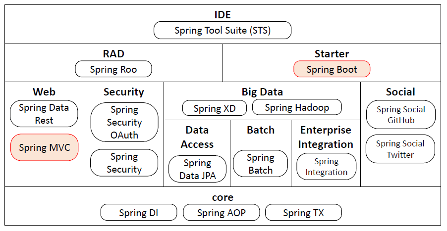

## Spring Bootとは
Spring Bootとは、Spring Frameworkをベースに必要最小限の構成設定でWebアプリケーションを簡単に開発できるようなライブラリのことである。Spring Frameworkは、Pivatal社が開発しているフレームワークであり、Webアプリケーションを開発するための機能が標準で備わっている。しかし、Spring Frameworkのみを利用したWebアプリケーションの開発は、多くの構成設定や仕様理解を必要とし容易ではない。そこで、簡単に開発・実行できるライブラリとしてSpring Bootが存在する。

Spring Frameworkには、Spring Boot以外にも様々なライブラリが含まれている。以下に構成を示す。今回はこの構成図のうち、Spring BootとSpring MVCを利用する。



Spring Bootを利用する利点としては、本来サーブレットやSpring Frameworkを用いたWebアプリケーションは、実行環境であるTomcatと呼ばれるミドルウェアにデプロイしなければならない。動作確認するために毎度、ビルドし実行ファイルをTomcatに配置しなければならず、手間を要する。

Spring Bootを利用すると、Spring Boot自体にTomcatが含まれているため、ビルド後のファイルをJavaアプリケーションとして実行するだけで、開発したWebアプリケーションの動作確認を行うことができる。

Spring Bootを利用してWebアプリケーションを開発する場合、Spring Bootの仕様や設定、ライブラリ機能を利用する形で実装しなければならない。まずは、Spring BootでWebアプリケーションを開発する際に必要な事前知識および構成設定内容を説明する。

### アプリケーションの構成設定
データベースの接続先の情報やエラーメッセージのデータといった情報は、Webアプリケーションを動作させる上で必要不可欠な設定情報である。Spring Bootではそのような構成設定情報を登録しておく場所があり、 **コンテナ** と呼ばれている。このコンテナに必要な情報を登録しておくと、アプリケーション起動時に自動的に読み込んでくれる。

また、このコンテナには設定情報だけでなくアプリケーション全体で利用したい機能も登録することができる。Spring Boot内部では、コンテナは ``Application Context`` というクラスで存在している。

ここで、コンテナに設定情報や機能を登録する方法について説明する。例えば、``system/configuration/AppConfig.java`` を見てみよう。

```java
@Configuration
@EnableWebMvc
@EnableSpringDataWebSupport
@ComponentScan(basePackages = "system")
public class AppConfig implements WebMvcConfigurer {

  @Autowired
  private MessageSource messageSource;

  // Springのデフォルトメッセージを独自の日本語メッセージに上書きする
  @Bean
  public LocalValidatorFactoryBean defaultValidator() {
    LocalValidatorFactoryBean factory = new LocalValidatorFactoryBean();
    factory.setValidationMessageSource(messageSource);
    return factory;
  }

  // ・・・・
}
```

コンテナに登録するには、クラスの定義(``public class ...``)の前に ``@Configuration`` が付いたクラスにて、登録したいデータまたは機能を含むクラスのオブジェクトを生成するメソッドを記述し、 ``@Bean`` をメソッドに付与すれば登録できる。
このクラスでは、入力チェックでエラーになった時に表示するメッセージをコンテナに登録している。コンテナに登録したオブジェクトは、Bean(ビーン)と呼ばれている。

``@`` から始まる記述は、アノテーションと呼ばれクラスの定義やメソッドの定義、クラスメンバの定義の上に記述される。アノテーションを付与することで、クラスの定義やメソッドの定義に対して役割を付与することができる。ここでは、 ``AppConfig``クラスに ``@Configuration`` を付与することでこのクラスが構成設定を設定しているクラスであることを表している。

DBの接続設定については、 ``system/configuration/JpaConfiguration.java`` にて登録している。こちらについても参照しておいて欲しい。
