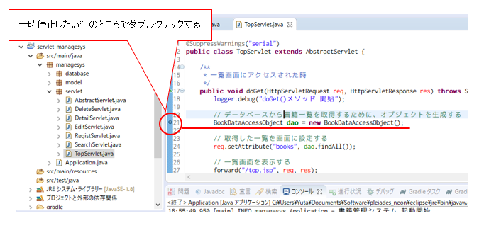
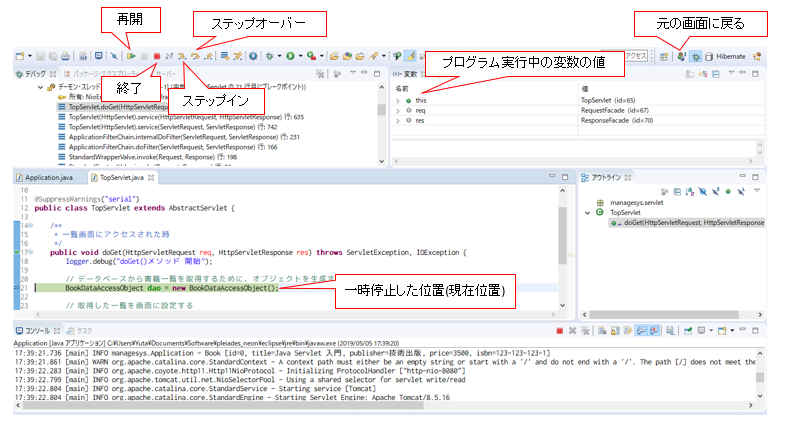

## デバッグ方法
実行時のプログラム内の変数の値や挙動を確認する方法として、次の2つがある。

### ログによる挙動確認
最も簡単な挙動確認方法としては、Eclipseのコンソールタブ欄に表示される出力を見ることである。
ログとは、システムが動作した履歴を文字列ベースで出力したものである。

本課題のログは次の形式で出力されている。それぞれの内容を下記表にまとめる。

```
時刻 [実行したスレッド名] ログレベル 実行したクラス - メッセージ
```

|項目名|概要|
|:---|:---|
|時刻|ログを出力した時刻|
|実行したスレッド名|プログラムを実行しているスレッドの名前(今回のデバックでは用いないので無視して問題ない。)
|ログレベル|実行環境によっては出力するログに制限をつけ一部のログだけ出力したいときもある。その時に利用するためのレベル。(今回のデバックでは用いないので無視して問題ない。)|
|実行したクラス|実行したクラス名が出力される。末尾の名前がクラス名となる。|
|メッセージ|実行した処理の内容を出力している。このメッセージは任意で設定できる。|

実際に動かしてログを見てみると以下のようになっている。試してみてほしい。

```
2019-06-12 15:50:56.045  INFO 13704 --- [           main] system.Application                       : Started Application in 16.049 seconds (JVM running for 17.456)
2019-06-12 15:51:14.860  INFO 13704 --- [io-8080-exec-10] o.a.c.c.C.[Tomcat].[localhost].[/]       : Initializing Spring FrameworkServlet 'dispatcherServlet'
2019-06-12 15:51:14.860  INFO 13704 --- [io-8080-exec-10] o.s.web.servlet.DispatcherServlet        : FrameworkServlet 'dispatcherServlet': initialization started
2019-06-12 15:51:14.989  INFO 13704 --- [io-8080-exec-10] o.s.web.servlet.DispatcherServlet        : FrameworkServlet 'dispatcherServlet': initialization completed in 129 ms
2019-06-12 15:51:15.674  INFO 13704 --- [io-8080-exec-10] system.common.LogInterceptor             : class system.controller.BookController.listBooks() Start.
2019-06-12 15:51:15.697  INFO 13704 --- [io-8080-exec-10] system.common.LogInterceptor             : class system.service.BookService.findAllBooks() Start.
Hibernate: 
    SELECT
        * 
    from
        Book
2019-06-12 15:51:15.854  INFO 13704 --- [io-8080-exec-10] system.common.LogInterceptor             : class system.service.BookService.findAllBooks() End.
2019-06-12 15:51:15.855  INFO 13704 --- [io-8080-exec-10] system.common.LogInterceptor
```

上記ログから分かることは、以下の通り。

- 書籍管理システムの起動が完了したこと。
- ``BookController``クラスの``listBooks``メソッドが呼ばれ、DBクラスによりSQLを実行、そのメソッドの処理が完了したこと。
  - 実行したSQLが、``SELECT * from Book``であること。

また、Eclipseのコンソールにメッセージを出力させたい場合は、出力したい箇所で``System.out.println("[メッセージ]");``を記述すればよい。
例えば、``listBooks``メソッドが呼ばれたときに「testtest」と出力させたい場合は、以下のように記述すればよい。

```java
public String listBooks(TitleSearch search, ModelMap model) {
  // コンソール出力を記述
  System.out.println("testtest");
  // サービスより、書籍を全件取得する。
  List<Book> books = service.findAllBooks();
  // サービスから取得した書籍リストを画面に設定する。
  model.addAttribute("books", books);
  // 一覧画面を返却する。
  return "list";
}
```

### デバッガ―による挙動確認
デバッガにより逐次実行しながら、プログラムの挙動を確認することもできる。簡単に手順を以下に示す。

1. 挙動を確認したいプログラムを開き、左側行番号隣のスペースをダブルクリックする。すると、青い円形マークが付く。  
デバッグ実行すると、この場所でプログラムが一時停止することになる。
    
1. Application.javaをを右クリックし、「デバッグ」から「Javaアプリケーション」を選択する。
1. デバッガのパースペクティブを開きますかとのメッセージが表示されるので、「はい」を押下する。
    
1. ツールバー上のステップオーバーのボタンを押下すると次の行に進めることができる。
    - ステップインは、そのメソッドの中も逐次実行することを意味する。
    - ステップオーバーは、そのメソッドの中は飛ばして次の行に進めることを意味する。
1. 確認したいところをステップ実行できたら、「再開」ボタンを押下する。
    

元の画面に戻すときは、右上のJavaボタンを押下する。
