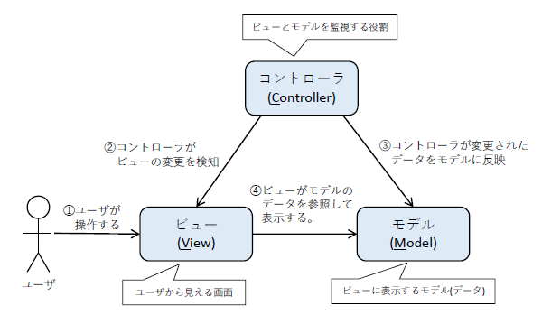

## MVCの概念
Webアプリケーションの構造には、[3層アーキテクチャ](./website.md)の他に**MVCモデル**と呼ばれる概念がある。
3層アーキテクチャは、画面、アプリケーション、データベースを3つの層に分ける概念であるが、MVCモデルはアプリケーション内の構造をMVCの3つに分ける概念である。

MVCモデルは、M・V・Cの3つの要素から構成される。「M」は **モデル(Model)**、「V」は **ビュー(View)**、「C」は **コントローラ(Controller)** の略である。

各要素の役割をまとめると以下の表となる。

|要素|役割|
|:---:|:---|
|モデル(M)|画面に表示するデータを表す|
|ビュー(V)|画面を表示しユーザからの操作を受け付ける|
|コントローラ(Ｃ)|モデルとビューの変更を監視する|

そして、各要素の関係を図としてまとめると以下のような図となる。

上図を順に説明する。

1. ユーザが画面を操作する。
1. コントローラがビューが変更されたことを察知する。
1. コントローラがビューの変更をモデルに反映する。
1. ビューは、モデルのデータを参照して表示する。

コントローラが監視役となり、ビューとモデルへの変更を通知、伝搬させることでビューとモデルのデータが連携され、ユーザの操作を正しく反映できる。
