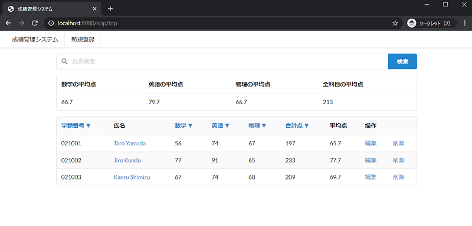
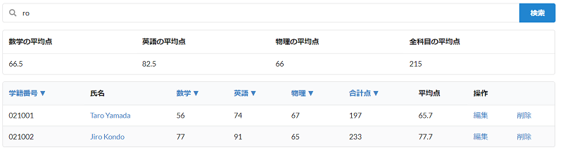
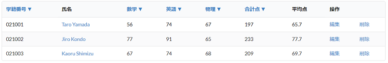
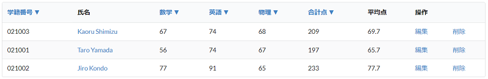
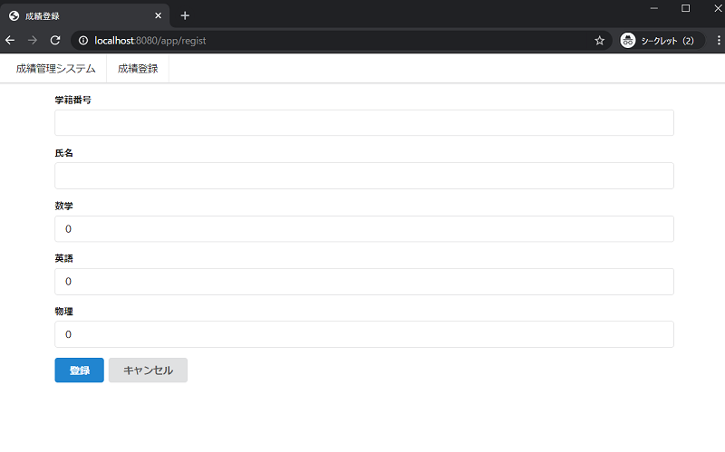
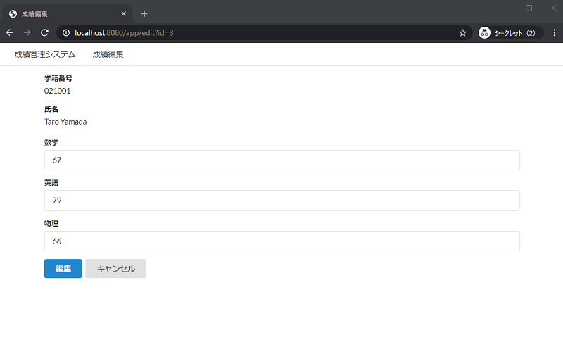
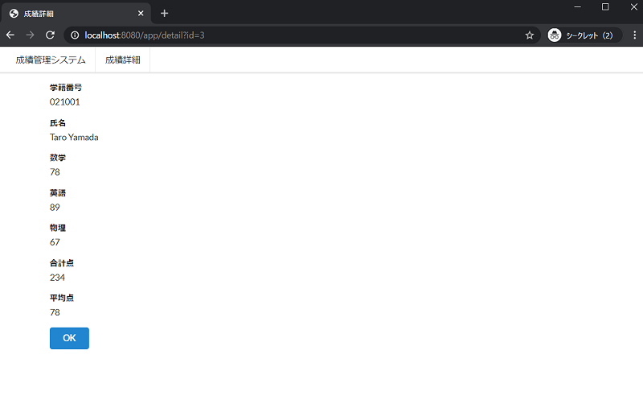

## 成績管理仕様
本コンテンツで開発する[成績管理システム](../score)(以降、本システム)の仕様について説明します。  

### 環境構築方法 
以下の手順で、インストールして開発環境を構築します。  

1. [Eclipse Pleiades](http://mergedoc.osdn.jp/)からEclipse Mars以降のEclipseをダウンロードする。  
> Mars以前のバージョンでは、Gradle Buildship版が標準インストールされてないので別途インストール作業が必要となります。  

1. 本プロジェクトをGradleプロジェクトとしてインポートする。

1. [Gradle](https://gradle.org/)により依存関係のあるライブラリが自動ダウンロードおよびビルドされる。

### 起動方法
以下の手順に従い、本システムを実行してください。

1. systemパッケージ直下にあるApplication.javaを右クリックし、「実行」から「Javaアプリケーション」を選択する。

1. コンソールに「成績管理システム　起動完了」と表示されたら、Chromeブラウザより[http://localhost:8080/](http://localhost:8080/)にアクセスする。

**※必ず利用し終わったら、Eclipseコンソール上の終了ボタンを押下し、アプリケーションを終了させてください。  
  次回実行時に、ポート番号が衝突し起動できなくなります。**

### 画面一覧と画面遷移図
本システムの画面一覧と画面遷移図は以下の通りです。

- 一覧画面
- 新規登録画面
- 編集画面
- 詳細画面


以降に、各画面の仕様を明記します。  

### 一覧画面
本システムに登録されている成績を一覧表示する画面  



#### 一覧表示
一覧表示では下記内容を表示する。

|項目名|表示内容|
|:---|:---|
|学籍番号|[成績].[学籍番号]|
|氏名|[成績].[氏名]|
|数学|[成績].[数学の点数]|
|英語|[成績].[英語の点数]|
|物理|[成績].[物理の点数]|
|合計点|[成績].[合計点]|
|平均点|[成績].[平均点]|
|操作|「編集」と「削除」を表示|

> 本資料ではデータベーステーブルのカラムを指定する場合、[テーブル名].[カラム名]で表記する。  

#### 氏名検索
検索ボタン押下時に入力されたキーワードを用いて、[成績].[氏名]カラムの部分一致検索を行う。  

  

#### 学籍番号並び替え(▼)
並び替えボタン押下時に、[成績].[学籍番号]を昇順に表示する。  

  

####  点数並び替え(▼)
並び替えボタン押下時に、[成績].[数学/英語/物理/合計点]を降順に表示する。  

  
※物理▼押下時

#### 削除
指定した成績データを削除する機能である。削除リンクが表示されている行の成績データを1件削除する。  

### 新規登録画面
新しい成績をシステムに登録するための画面  



成績データとして登録する情報は、以下の通り。  

|項目名|登録するカラム|
|:---|:---|
|学籍番号|[成績].[学籍番号]|
|氏名|[成績].[氏名]|
|数学|[成績].[数学の点数]|
|英語|[成績].[英語の点数]|
|物理|[成績].[物理の点数]|

登録時には、項目毎に下記入力チェックを実施する。

下記条件が全て満たされないと、成績データの登録はできない。

- 学籍番号
  - 未入力でないこと。
  - 同一の学籍番号がすでに存在しないこと。
  - 半角数字(0～9)であること。
  - 1文字以上、6文字以下であること。
- 氏名
  - 未入力でないこと。
  - 1文字以上、16文字以下であること。
- 点数(数学/英語/物理)
  - 半角数字(0～9)であること。
  - 0以上、100以下であること。

### 編集画面
既存の成績データを編集するための画面



成績データとして編集できる情報は、以下の通り。

|項目名|編集できるカラム|
|:---|:---|
|数学|[成績].[数学の点数]||
|英語|[成績].[英語の点数]||
|物理|[成績].[物理の点数]||

更新時には、項目毎に入力チェックを実施する。

### 詳細画面
既存の成績情報を表示するための画面



以下の項目を表示する。

|項目名|表示内容|
|:---|:---|
|学籍番号|[成績].[学籍番号]|
|氏名|[成績].[氏名]|
|数学|[成績].[数学の点数]|
|英語|[成績].[英語の点数]|
|物理|[成績].[物理の点数]|
|合計点|[成績].[合計点]|
|平均点|[成績].[平均点]|

### テーブル定義
本システムで利用するテーブル定義は以下の通りです。

成績(score)テーブル

|物理名|論理名|型|桁数|必須|備考|
|:---|:---|:---|:---:|:---:|:---|
|id|ID|bigint|-|○|主キー、自動採番|
|studentNumber|学籍番号|varchar|6|○||
|name|氏名|varchar|16|○||
|mathScore|数学の点数|bigint|-|○||
|englishScore|数学の点数|bigint|-|○||
|physicsScore|数学の点数|bigint|-|○||
|totalScore|数学の点数|bigint|-|○||
|averageScore|数学の点数|bigint|-|○||

### プロジェクト構成
利用しているフレームワーク及びツールは以下の通りです。

|構成|フレームワーク・ツール|
|:------:|:------:|
|Web UI|HTML, CSS([Semantic-UI CDN](https://semantic-ui.com/)), [Thymeleaf](http://www.thymeleaf.org/)|
|アプリケーションロジック|[Spring Boot](http://projects.spring.io/spring-boot/), [Hibernate](http://hibernate.org/)|
|データベース|[H2DB](http://www.h2database.com/html/main.html)|

また、本プロジェクトはGradleプロジェクトとして構築されており、各パッケージの役割は以下の通りです。

```
src/main
  + java/system
    - Application.java                … 本システムを起動するためのエントリポイント
    + anotation                       … 本プロジェクト独自のアノテーションを定義
    + common                          … アプリケーション共通の機能を定義するパッケージ
    　- LogInterceptor.java           … ログ出力機能を定義
      - TestDataGenerator             … 初期データ生成機能を定義
    + configuration                   … アプリケーションの構成設定を定義するパッケージ
      - AppConfig.java                … Webアプリケーションに関する設定を定義、主にバリデーションエラーメッセージの定義
      - HibernateProperties.java      … O/RマッパーであるHibernateの設定を定義
      - JpaConfigration.java          … JPAによるデータアクセスに関する設定を定義
    + controller                      … コントローラクラスを定義するパッケージ
      - ScoreController.java          … ブラウザからのリクエストを受け付けるコントローラクラス
    + model                           … データベーステーブルに紐づくモデルクラスを定義するパッケージ
      - Score.java                    … データベーステーブルに保存する成績モデルクラス
      - Model.java                    … モデルクラスを表すマーカーインターフェース
    + repository                      … データアクセス機能を定義するパッケージ
      - DefaultRepository.java        … モデルに関するデータアクセス機能を定義
    + service                         … アプリケーションの機能を定義するパッケージ
      - ScoreService.java             … 成績モデルに関するサービスクラス
  + resources
    + templates                       … 各ページのhtmlテンプレート
    - application.yml                 … 環境変数の設定ファイル
    - messages-validation.properties  … バリデーションメッセージを定義
```

[トップページへ](../README.md)