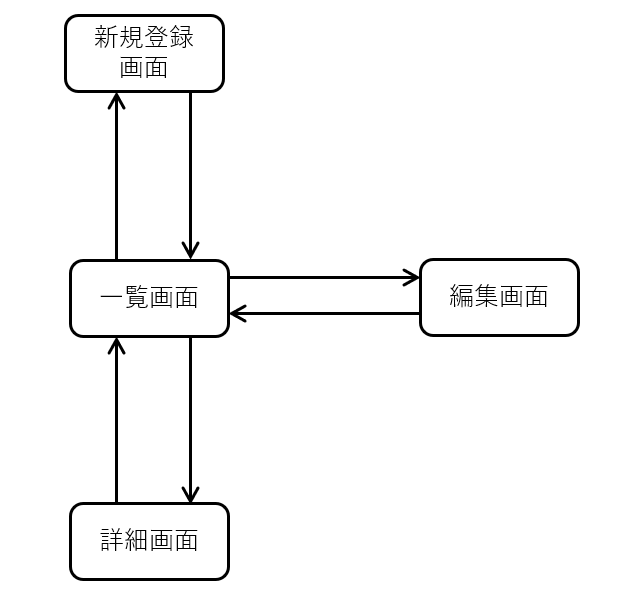
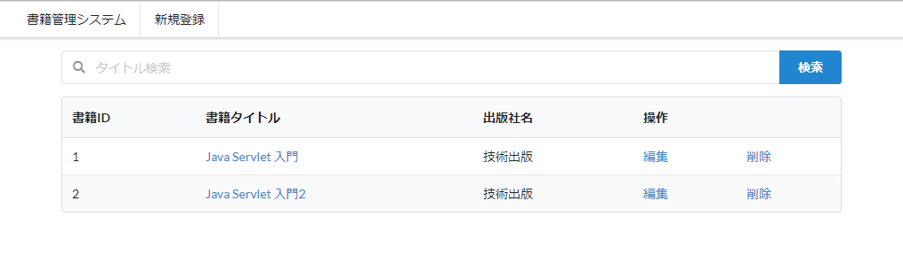
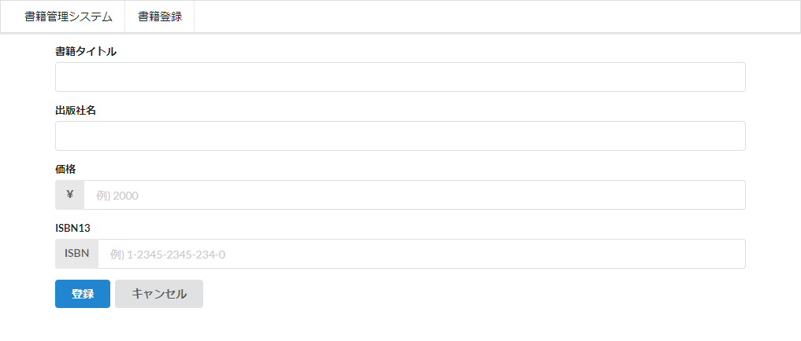
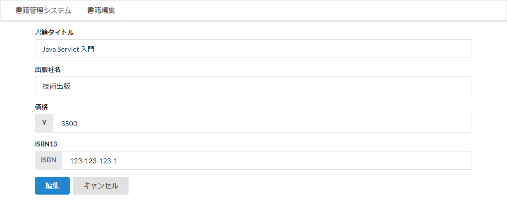
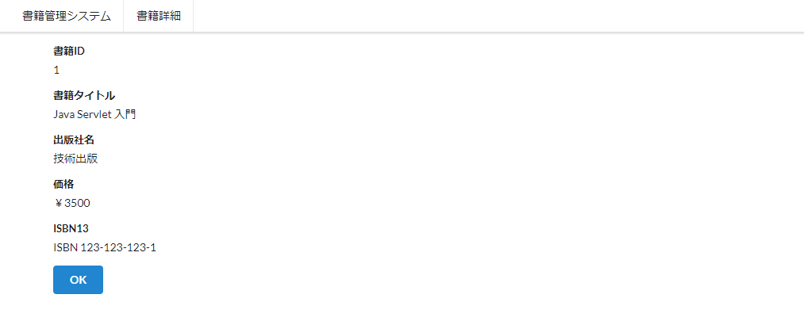

## 書籍管理システムについて
本コンテンツで開発する[書籍管理システム](../book)(以降、本システム)の仕様について説明する。

### 環境構築方法
以下の手順で、インストールして開発環境を構築する。

1. [Eclipse Pleiades](http://mergedoc.osdn.jp/)からEclipse Mars以降のEclipseをダウンロードする。  
Mars以前のバージョンでは、Gradle Buildship版が標準インストールされてないので別途インストール作業が必要となる。

1. 本プロジェクトをGradleプロジェクトとしてインポートする。

1. [Gradle](https://gradle.org/)により依存関係のあるライブラリが自動ダウンロードおよびビルドされる。

### 起動方法
以下の手順に従い、本システムを実行してください。

1. systemパッケージ直下にあるApplication.javaを右クリックし、「実行」から「Javaアプリケーション」を選択する。

1. コンソールに「system.Application」と表示されたら、Chromeブラウザより[http://localhost:8080/](http://localhost:8080/)にアクセスする。

**※必ず利用し終わったら、Eclipseコンソール上の終了ボタンを押下し、アプリケーションを終了させてください。  
次回実行時に、ポート番号が衝突し起動できなくなります。**

### 画面一覧と画面遷移図
本システムの画面一覧と画面遷移図は以下の通りである。

- 一覧画面
- 新規登録画面
- 編集画面
- 詳細画面



### 一覧画面
一覧画面は、本システムに登録されている書籍を一覧表示する画面である。



#### 一覧表示
一覧表示では下記内容を表示する。

|項目名|表示内容|
|:---|:---|
|書籍ID|[書籍].[ID]|
|書籍タイトル|[書籍].[タイトル]|
|出版社名|[書籍].[出版社名]|
|操作|「編集」と「削除」を表示|

> 本資料ではデータベーステーブルのカラムを指定する場合、[テーブル名].[カラム名]で表記する。

#### タイトル検索
検索ボタン押下時に入力されたキーワードを用いて、[書籍].[タイトル]カラムの部分一致検索を行う。

#### 削除
指定した書籍データを削除する機能である。削除リンクが表示されている行の書籍データを1件削除する。

### 新規登録画面
新しい書籍をシステムに登録するための画面



書籍データとして登録できる情報は、以下の通り。

|項目名|登録するカラム|
|:---|:---|
|書籍タイトル|[書籍].[タイトル]|
|出版社名|[書籍].[出版社名]|
|価格|[書籍].[価格]|
|ISBN13|[書籍].[ISBN]|

登録時には、項目毎に下記入力チェックを実施する。

下記条件が全て満たされないと、書籍データの登録はできない。

- 書籍タイトル
  - タイトルが未入力でないこと。
  - 文字数が1文字以上30文字以下であること。
- 出版社名
  - 出版社名が未入力でないこと。
  - 文字数が1文字以上10文字以下であること。
- 価格
  - 価格が未入力でないこと。
  - 半角数字(0～9)であること。
- ISBN13
  - ISBN13が未入力でないこと。
  - 半角数字(0～9)、もしくはハイフン(-)であること。
  - 文字数が13以上17以下であること。

### 編集画面
既存の書籍データを編集するための画面



書籍データとして編集できる情報は、以下の通り。

|項目名|編集できるカラム|
|:---|:---|
|書籍タイトル|[書籍].[タイトル]|
|出版社名|[書籍].[出版社名]|
|価格|[書籍].[価格]|
|ISBN13|[書籍].[ISBN]|

更新時時には、項目毎に下記入力チェックを実施する。

下記条件が全て満たされないと、書籍データの編集はできない。

- 書籍タイトル
  - タイトルが未入力でないこと。
  - 文字数が1文字以上30文字以下であること。
- 出版社名
  - 出版社名が未入力でないこと。
  - 文字数が1文字以上10文字以下であること。
- 価格
  - 価格が未入力でないこと。
  - 半角数字(0～9)であること。
- ISBN13
  - ISBN13が未入力でないこと。
  - 半角数字(0～9)、もしくはハイフン(-)であること。
  - 文字数が13以上17以下であること。

### 詳細画面
既存の書籍情報を表示するための画面



以下の項目を表示する。

|項目名|表示内容|
|:---|:---|
|書籍ID|[書籍].[ID]|
|書籍タイトル|[書籍].[タイトル]|
|出版社名|[書籍].[出版社名]|
|価格|[書籍].[価格]|
|ISBN13|[書籍].[ISBN]|

### テーブル定義
本システムで利用するテーブル定義は以下の通り。

書籍(book)テーブル

|物理名|論理名|型|桁数|必須|備考|
|:---|:---|:---|:---:|:---:|:---|
|id|書籍ID|bigint|-|○|主キー、自動採番|
|title|書籍タイトル|varchar|256|○||
|publisher|出版社名|varchar|256|○||
|price|価格|varchar|256|○||
|isbn|ISBN13|varchar|256|○||

### プロジェクト構成
利用しているフレームワーク及びツールは以下の通りである。

|構成|フレームワーク・ツール|
|:------:|:------:|
|Web UI|HTML, CSS([Semantic-UI CDN](https://semantic-ui.com/)), [Thymeleaf](http://www.thymeleaf.org/)|
|アプリケーションロジック|[Spring Boot](http://projects.spring.io/spring-boot/), [Hibernate](http://hibernate.org/)|
|データベース|[H2DB](http://www.h2database.com/html/main.html)|

また、本プロジェクトはGradleプロジェクトとして構築されており、各パッケージの役割は以下の通りである。

```
src/main
  + java/system
    - Application.java                … 本システムを起動するためのエントリポイント
    + anotation                       … 本プロジェクト独自のアノテーションを定義
    + common                          … アプリケーション共通の機能を定義するパッケージ
    　- LogInterceptor.java           … ログ出力機能を定義
      - TestDataGenerator             … 初期データ生成機能を定義
    + configuration                   … アプリケーションの構成設定を定義するパッケージ
      - AppConfig.java                … Webアプリケーションに関する設定を定義、主にバリデーションエラーメッセージの定義
      - HibernateProperties.java      … O/RマッパーであるHibernateの設定を定義
      - JpaConfigration.java          … JPAによるデータアクセスに関する設定を定義
    + controller                      … コントローラクラスを定義するパッケージ
      - BookController.java           … ブラウザからのリクエストを受け付けるコントローラクラス
    + model                           … データベーステーブルに紐づくモデルクラスを定義するパッケージ
      - Book.java                     … データベーステーブルに保存する書籍モデルクラス
    + repository                      … データアクセス機能を定義するパッケージ
      - BookRepository.java           … 書籍モデルに関するデータアクセス機能を定義
    + service                         … アプリケーションの機能を定義するパッケージ
      - BookService.java              … 書籍モデルに関するサービスクラス
  + resources
    + templates                       … 各ページのhtmlテンプレート
    - application.yml                 … 環境変数の設定ファイル
    - messages-validation.properties  … バリデーションメッセージを定義
```

