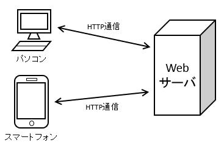
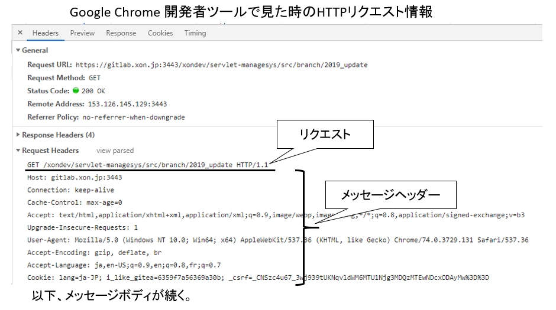
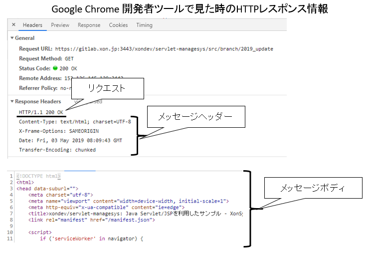
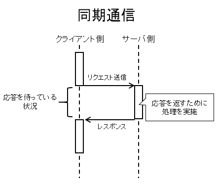
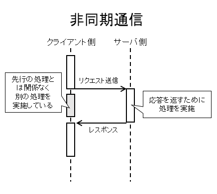
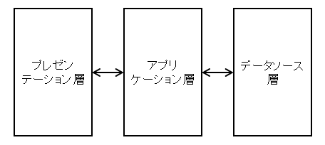
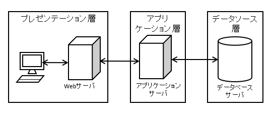

## Webサイトが閲覧できる仕組み
ここでは、Webブラウザを通してWebサイトが閲覧できる仕組みについて説明する。

### HTTPとは
私たちはスマートフォンでWebブラウザを起動し、ブックマークからお気に入りのサイトを閲覧したり、GoogleからWebページを検索してWebページを閲覧している。
Webページを閲覧するということは、以下の図のように私たちが日常的に利用するスマートフォンやPC(端末)とサーバがネットワークを通してデータのやりとりすることによって実現している。そのやり取りの仕方を取り決めているのが、HTTP(HyperText Transfer Protocol)である。

クライアントがサーバに対してリクエスト(要求)を送信すると、サーバはそのリクエストに応じたレスポンス(応答)を返す。サーバはレスポンスを返すにあたって必要なデータを取得・加工しレスポンスとしてまとめ返す。そして、クライアントがそのレスポンスに応じて画面に描画し、一つの要求が完了する。

### HTTPリクエストとHTTPレスポンス
#### HTTPリクエスト
クライアントからサーバに対して要求を送信する際のHTTPリクエストについて説明する。
HTTPリクエストは、リクエスト、メッセージヘッダ、メッセージボディの3つに分かれる。

リクエストには後述するHTTPメソッド名やパス、HTTPのバージョンといった情報が記載されている。また、メッセージヘッダにはクライアント側のブラウザの種類、OSの種類、対応しているデータの形式、文字コード、言語といった情報が記載されている。メッセージボディには、リクエストで送信したい内容(データ)が文字列で記載されている。

#### HTTPレスポンス
サーバからクライアントに対して応答を送信する際のHTTPレスポンスについて説明する。
HTTPレスポンスは、ステータス、メッセージヘッダ、メッセージボディの3つに分かれる。

ステータスにはHTTPのバージョンやステータスコードといった情報が記載されている。また、メッセージヘッダにはクライアント側のブラウザの種類、OSの種類、対応しているデータの形式、文字コード、言語といった情報が記載されている。メッセージボディには、レスポンスとして応答したい内容(データ)が文字列で記載されている。

上記の内容は、ChromeブラウザのF12キーを押下して開発者ツールにて内容を確認することができるため、今回の課題を利用して確認してみてほしい。

### HTTPメソッド
HTTPリクエストを用いてクライアントからサーバにリクエストをするときの方法(メソッド)は、複数存在する。主なHTTPメソッドとしては、GET, POST, PUT, DELETE, PATCHなどがある。ここでは、今回の課題で用いるGETメソッドとPOSTメソッドについて紹介する。

#### GETメソッド
GETメソッドは、WebアプリケーションのURL末尾にサーバに対して送信したいデータ(文字列)を付与して送信する。
たとえば、検索画面に入力された検索キーワードをサーバに送信したい場合は、サイトのURLが``http://exmaple.com``、入力されたキーワードが「servlet」とすると、GETメソッド時のURLは、``http://exmaple.com?keyword=servlet``となる。

GETメソッドはURLに送信したいデータを付与するだけ簡単に送信できるというメリットがある一方で、URLには文字数制限があり大量のデータを送信することはできないというデメリットもある。また、送信したいデータをURL上に付与するため、第三者から送信するデータが完全に見えてしまうというセキュリティ上の問題もある。

GETメソッドは送信するデータ量が少なく、第三者に見られても良いようなデータを送信するときに有効な方法である。大量のデータを送信する場合や第三者に見られたくないデータを送信したい場合は、次のPOSTメソッドを利用する。

#### POSTメソッド
POSTメソッドは、サーバにデータを送信するデータを **WebアプリケーションのURL末尾に付与するのではなく** 、リクエスト本文に追加し送信する方法である。

### クライアントとサーバ間でやり取りする通信方式
クライアントとサーバ間でやり取りする通信方式には、次の2種類がある。
後述のGETリクエストとPOSTリクエストと組み合わせて利用する。

#### 同期通信
同期通信は、クライアントからサーバに対してリクエストを送信すると、サーバがそのレスポンスを返すまでクライアントが待つ方式である。

サーバからのレスポンスを待つため、サーバ内の処理に時間を要する場合は画面が固まってしまうため、同期通信よりも非同期通信の方が望ましい。
今回の課題では同期通信のGETリクエストおよびPOSTリクエストのみ利用している。

#### 非同期通信(Ajax)
非同期通信は、クライアントからサーバに対してリクエストを送信すると、サーバからのレスポンスを待たクライアントの処理を継続する方式である。

サーバからの応答に時間がかかる場合でも応答を待たないため、ローディング表示ができるといったメリットがある。
非同期通信による実装は、JavaScriptを用いて実装する必要があり、今回の課題では用いていない。

## Webアプリケーションの仕組み
ネットワーク上のサーバとやり取りしてWebブラウザ上で動作するアプリケーションをWebアプリケーションと呼ぶ。
Webアプリケーションは、前述のHTTPの技術とソフトウェアの技術を組み合わせて実現する。

Webアプリケーションの構造として一般的なのでは、3層アーキテクチャである。3層とは、ユーザが操作する画面である「プレゼンテーション層」、アプリケーション内の処理を実行する「アプリケーション層」、データの取得や保存を行う「データソース層」の3つである。

この3層アーキテクチャは、F.ブッシュマンらが執筆した書籍「Pattern Oriented Sofware Architecture」のうちのレイヤ化パターン(Layers)を利用したものである。レイヤ(Layer)とは、論理的なソフトウェア上の階層を意味しており、物理的なハードウェアの階層を意味していない。そのため、上記3つの階層を1つのサーバで実現しても問題ないし、3つの階層を別々の3つのサーバで実現しても問題ない。後者のような物理的なハードウェアの階層は、ティア(段:Tier)と呼ばれている。

今回の課題では、プレゼンテーション層にJava Server Pages(JSP)、アプリケーション層にJavaサーブレット、データソース層にH2データベースを用いてWebアプリケーションを実装する。

### サーブレットとは
サーブレットとは、Webサーバ上でJava言語で書かれたプログラムを実行することで、データを処理しWebページを動的に生成するための仕組みである。
前述までのHTTPの仕組みとJavaプログラムを利用して、ボタンやリンクを押下するとWebページの表示が動的に切り替わるWebアプリケーションを開発できる。
