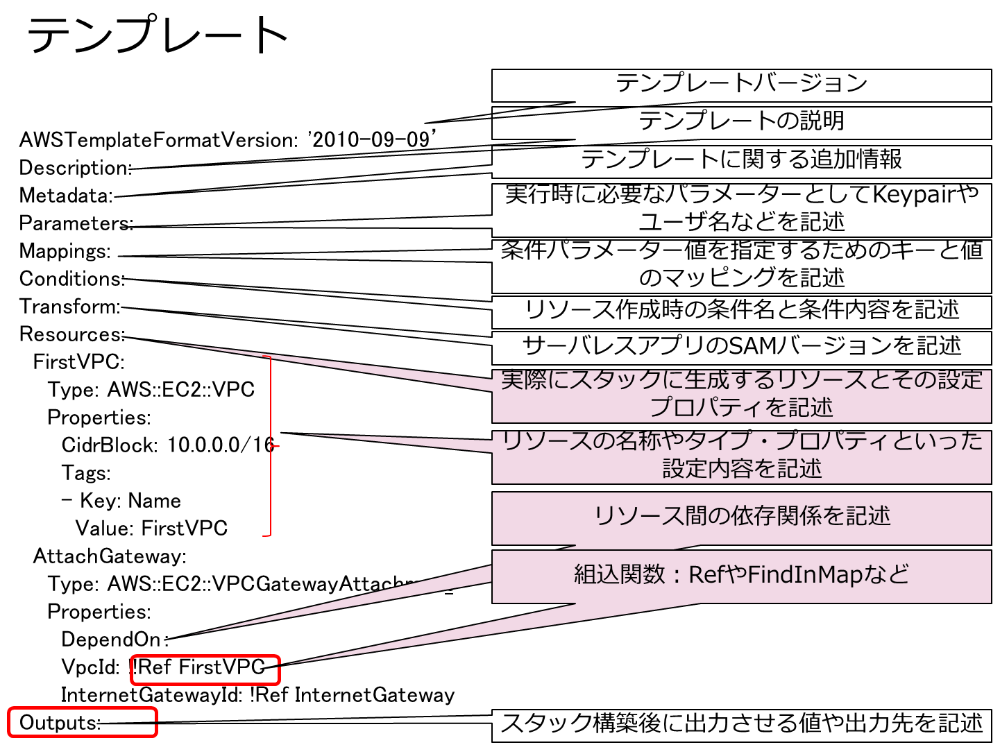
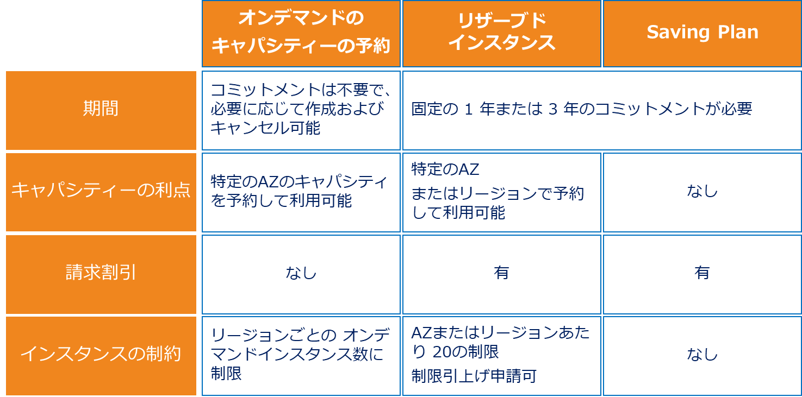

# 不正解問題 - 解説 <!-- omit in toc -->

- [1. Amazon FSx](#1-amazon-fsx)
  - [1.1. 特徴](#11-特徴)
  - [1.2. アーキテクチャ](#12-アーキテクチャ)
- [2. Amazon EFS](#2-amazon-efs)
- [3. DynamoDB](#3-dynamodb)
  - [3.1. 問 5.](#31-問-5)
- [4. RDS](#4-rds)
  - [4.1. 問 6.](#41-問-6)
  - [4.2. 問 44.](#42-問-44)
- [5. S3](#5-s3)
  - [5.1. 問 23.](#51-問-23)
  - [5.2. 問 24.](#52-問-24)
  - [5.3. 問 34.](#53-問-34)
  - [5.4. 問 43.](#54-問-43)
- [6. ElastiCache](#6-elasticache)
- [7. CloudFormation](#7-cloudformation)
  - [7.1. 問 2.](#71-問-2)
- [8. CloudFront](#8-cloudfront)
  - [8.1. 問 4.](#81-問-4)
- [9. EC2](#9-ec2)
  - [9.1. 問 9.](#91-問-9)
  - [9.2. 問 15.](#92-問-15)
  - [9.3. 問 16.](#93-問-16)
- [10. AWS Lake Formation](#10-aws-lake-formation)
- [11. SCP](#11-scp)
- [12. 認証サービス](#12-認証サービス)
  - [12.1. 問 56.](#121-問-56)

## 1. Amazon FSx

### 1.1. 特徴

- Windows File Server の機能を利用可能
- Active Directory 統合などの幅広い管理機能
- SMB プロトコルにより Amazon EC2、VMware Cloud on AWS、Amazon Workspaces、Amazon AppStream2.0 インスタンスなど幅広く接続可能
- 最大数千台のコンピューティングインスタンスからのアクセス可能

### 1.2. アーキテクチャ

- ENI 経由でアクセス
- VPC セキュリティグループでの制御
- 単一 AZ の単一サブネットを指定して構成する
- 複数インスタンスでの共有や他 AZ 内のインスタンスからのアクセスも可能
- マルチ AZ 構成を実現することもできる

---

## 2. Amazon EFS


---

## 3. DynamoDB

### 3.1. 問 5.

Lambda は、DynamoDB から取得したデータに任意の集計をかける関数を開発することができる。

S3Select による SQL 解析は、S3 を対象にしか利用できない。

---

## 4. RDS

### 4.1. 問 6.

RDS の読取パフォーマンス低下時の対応策は以下がある。

- リードレプリカの増設 (_低コストでパフォーマンスと耐久性向上_)
- インスタンスタイプの高性能なタイプへの変更 (高コスト高パフォーマンスだが ElastiCache 以下)
- キャッシュレイヤーでの ElastiCache の利用 (_高コスト高パフォーマンス_)

### 4.2. 問 44.

RDS プロキシはアプリケーションと RDS データベースの間の仲介役として機能する。必要となるデータベースのコネクションプールを確立及び管理し、アプリケーションからデータベース接続を少なく抑える機能。

Lambda 関数は RDS エンドポイントではなく RDS プロキシを利用して接続することが求められる。
Lambda 関数によって作成された同時接続をスケーリングするために必要なコネクションをプーリングする。

---

## 5. S3

### 5.1. 問 23.

HTTP503 レスポンスは「サービスが利用できない」ときに表示されるエラー。

バージョニングを有効にしたバケットに対して当該エラーが発生する要因は、数百万のバージョンを有する 1 つ以上のオブジェクトが存在している可能性がある。

この場合、Amazon S3 は、過剰なリクエストトラフィックからユーザーを保護するためのバケットへのリクエストを自動的に調整する。

そのため、ライフサイクル管理の「NonCurrentVersion」有効期限ポリシーと「ExpiredObjectDeleteMarker」ポリシーを有効にして、以前のバージョンのオブジェクトを期限切れにすることが必要である。


### 5.2. 問 24.

IAM Access Analyzer は、AWS アカウントの外部からアクセスできるリソースを特定する総合的な解析を実行する。これにより、S3 の外部アカウントからのアクセス情報を分析して、不正なアカウントアクセスがないかを確認することができる。

【IAM の記録管理】


### 5.3. 問 34.

Cross-Origin Resource Sharing(CORS)を有効化すると、既にドメインが設定されている S3 バケットを他のドメインに共有することが可能となる。

### 5.4. 問 43.


---

## 6. ElastiCache


---

## 7. CloudFormation

### 7.1. 問 2.

パブリックサブネット内のリソースに対して SSH(22)によるアウトバウンドをインバウンドトラフィック両方の許可設定が必要。

**Egress** を `true` とすることでアウトバウンドトラフィック設定になる。



---

## 8. CloudFront

### 8.1. 問 4.

オリジンからファイルを取得するとき、CloudFront は各エッジロケーションでファイルを圧縮する。ビューワーがリクエストヘッダーに `Accept-Encoding:gzip` を含めるようリクエストすると CloudFront はファイルを圧縮して、ファイルを供給するよう設定ができる。

---

## 9. EC2

### 9.1. 問 9.



### 9.2. 問 15.

インスタンスの CPU 利用率がアイドル状態となっている時間帯が発生しており、大規模な EC2 インスタンス群による処理が非効率になっていることが問題点。定常的なインスタンス処理はコスト効率が悪く、高度な計算処理が発生した際は多数のインスタンスが必要となる。

不可に応じた増減が適切にできるように**スポットフリート**を利用したスポットインスタンスの調整が解決策となる。


### 9.3. 問 16.

```
このWEBアプリケーションはコスト効率に運営するために、
オンデマンドインスタンスとスポットインスタンス で構成されるインスタンスグループを動的に運営することが必要
```

EC2 フリートを利用して、オンデマンドインスタンスとスポットインスタンスで構成されるインスタンスグループを作ることができる。

---

## 10. AWS Lake Formation

S3 を利用したデータレイク構成を容易に実施することができるサービス。

Lake Formation は DB とオブジェクトストレージからデータを収集及びカタログ化して、データを Amazon S3 データレイクに移動して保存することができる。

---

## 11. SCP

SCP では明示的な `Deny` 要素が、最初の明示的な `Allow` よりも優先されるため、影響を受けるアカウントのユーザーは DynamoDB アクションを実行できない。

デフォルトで「FullAWSAccess」が付与されている場合、全リソースに対する全操作が明示的に許可されている状態となる。
そこに、ブラックリスト形式で特定の操作を拒否すると、対象リソースの操作が拒否されるものの、その他のリソースについては「FullAWSAccess」が維持された状態になる。

---

## 12. 認証サービス

### 12.1. 問 56.

> CloudFront を利用したコンテンツ配信処理が安全ではないため、Origin サーバーと CloudFront へのデータ通信をセキュアにすることを要求されました。この Origin サーバーは ELB ではないことに留意が必要です。
> この要件に対応するための最適な方法を選択してください。

> A. サードパーティの CA 証明書をオリジンと CloudFront 側の両方に利用して、HTTPS によるデータ通信を可能にする。

CloudFront とカスタムオリジン間の HTTPS 通信を設定する必要があり、オリジンが ELB ではない要件となっているため、信頼できる CA によって証明書が発行される必要がある。

* AWS Certificate Manager(ACM)が提供するSSL/TSL証明書を使用する
* サードパーティ認証機関からの証明書をACMまたはIAM証明書ストアにインポートする
* 自己署名した認証書を作成してインポートする