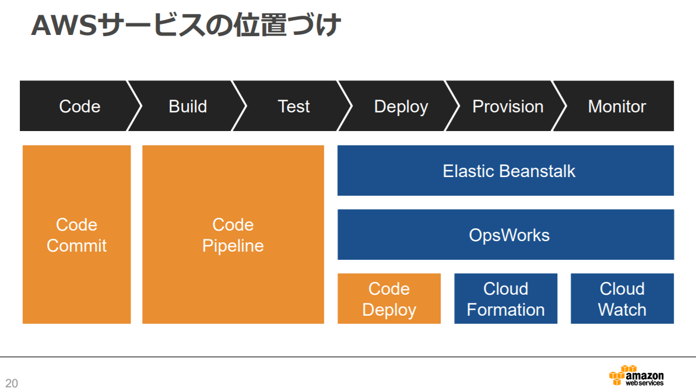

# PaaS

## ■ AWS Elastic Beanstalk

作成したアプリケーションをクラウドにデプロイするだけで、Web アプリケーションとして利用できる。

Web サーバの**オートスケーリング**にも対応しており、**ロードバランサ**やスケールするためのインフラを設計することなく、簡単にスケールする Web アプリケーションを稼働できる。

**スケールアウト**には、AWS の提供する負荷分散のサービスである ELB を利用する。

 

## 1. デプロイ&即アプリ起動

開発した Java アプリケーションを Eclipse もしくは Management Console からアプリケーションをデプロイするだけでアプリケーションが起動する。

 

## 2. モニタリング機能

- CPU 使用率、リクエスト数、**Tomcat**サーバのログなどを画面から簡単に確認できる。

- アプリケーションサーバの追加、削除などの状態変化のタイミングでメール通知することも可能。

 

## 3. データベースが選択可能

利用する DB サーバとして、「Amazon RDS」「Amazon SimpleDB」「Microsoft SQL Server」「Oracle」から選択可能。

 

## 4. 緩い制限

Elastic Beanstalk 上の実体は、Amazon EC2 上で動作する**仮想マシン**。

**_EC2 上でできることは、Elastic Beanstalk 上でも可能_**。サイトアクセス、マルチスレッド、プロセス呼び出しなどの制限は受けない。

 

## 5. 基本的には無料

インスタンス、ストレージ、ネットワークトラフィックは、通常の AWS と同じように課金される。

Elastic Beanstalk 自身は無料。

---

## ■ AWS CloudFormation

- EC2 や ELB といった AWS リソースの環境構築を、設定ファイル(テンプレート)を基に自動化できるサービス

- テンプレートを自由に作成できるため、自分好みのシステム構成を自動的に構築できる

- テンプレートには起動すべきリソースの情報を JSON や YAML フォーマットのテキスト形式で記述する

 

## 1. ユースケース

- AWS リソースの管理・構築を効率化したい

- 開発標準に基づいてインフラ作成・更新をしたい

- リソースの依存関係やプロビジョニングの順序を確実にしたい

 

## 2. 特徴

- 一度テンプレートを作成すれば、同じ構成を再現できる

- ベストプラクティスが盛り込まれたテンプレートが使用可能

- 起動時にパラメタを渡せる

- 主に Provisioning (プロビジョニング)を担当

---

## ■ AWS OpsWorks

サーバーのパッチ適用、アップデート、バックアップが自動的に実行され、Chef や Puppet （あらかじめ用意しておいた設定ファイルに基づいて、サーバーのさまざまな設定を自動的に行うソフトウェア、設定管理ツール）
のマネージド型インスタンスを利用できるようになる、構成管理サービス。

 

要するに...

 

- 独自の設定管理システムを運用したり、そのインフラストラクチャを管理しなくて良い

- サーバーのパッチ適用、アップデート、バックアップの自動化

- ソフトウェアの設定、パッケージのインストール、データベースのセットアップ、サーバーのスケーリング、コードのデプロイといった運用が自動化

- サポート範囲は、Amazon EC2 インスタンス、Amazon EBS ボリューム、Elastic IP、Amazon CloudWatch メトリクスなど、アプリケーション志向の AWS リソースに限られている

 

## 1. Chef

- ファイルに記述した設定内容に応じて自動的にユーザーの作成やパッケージのインストール、設定ファイルの編集などを行うツール

- Chef では「Cookbook（クックブック）」や「Recipe（レシピ）」と呼ばれる設定ファイルの再利用がしやすい構造になっている点が特徴

- 主に Ruby で記述される

 

## 2. Puppet

- サーバーの環境設定やインストールなどを自動化する設定管理ツール。

- Puppet も Ruby で実装されており、各種操作の実行を行うためのフロントエンドである puppet コマンドと、各種機能を実装した Ruby ライブラリから構成されている

 

---

## ■ AWS CodeDeploy

EC2、Fargate、Lambda、オンプレサーバにアプリケーションのデプロイを自動で実行するフルマネージドサービス。

テンプレートにないアプリケーションの導入、OS やミドルウェアの設定も行える。

> アプリケーションを構成している「**ファイル群**」をステージング環境や本番環境といった「**グルーピングされたサーバ群**」に**定められた手順で自動配置**するサービス。  
> ※ステージング環境：本番環境と同様の状態でシステムの動作や不具合をチェックする開発環境のこと。

 

## 1. 特徴

- デプロイ対象ファイルの取得元としては、S3 と github の 2 つのいずれかを指定

- デプロイ先のサーバー群をグルーピングし、そのグループ単位でデプロイ指示が可能

- EC2 だけでなく、オンプレ環境のサーバーへのデプロイも可能

- ローリングデプロイ(※)などのデプロイ方法を指定可能  
  ※複数の稼働中サーバーに対して一定数ずつ新しいアプリケーションをデプロイ、リリースしていく方法

- AppSpec ファイル(デプロイの詳細を定義したファイル:appspec.yml)により、デプロイ前後に自分で作成したスクリプト処理を挟み込んで実行することが可能

- デプロイ時の履歴情報(いつ、どこにデプロイした、デプロイが成功した/失敗した、失敗時のエラーログ)を後から参照可能

 

## 2. ユースケース

基本的にはアプリケーションのデプロイ。

- デプロイ処理の起動&管理自動化
  CI ツールと連動させてデプロイの CI(※)を行う王道的な使い方。
  デプロイの中身の処理は CodeDeploy で、CodeDeploy の起動と実行管理は CI ツールで自動化するもの。

  > ※ CI ( Continuous Integration：継続的インテグレーション)：  
  > ※ ソフトウェア開発初期から、テストやビルドを繰り返すことでバグを早期発見する手法  
  > ※ 結果、開発後期にバグが見つかり修正に必要な作業が膨大化するのを予防できる

- Windows カスタムメトリックス設定処理の自動化 (応用事例) [参考リンク：DevelopersIO](https://dev.classmethod.jp/articles/codedeploy-cloudwatch/)
  CodeDeploy のエージェントプログラムをファイル配置処理に活用し、通常だと自動化のハードルが少々高い Windows の
  カスタムメトリックスの設定処理(パフォーマンスモニター使用版の設定処理)の自動化を行う。

---

## ■ Beanstalk vs. CloudFormation vs. OpsWorks

### > ざっくり

| AWS Resource   | Description                                                                                |
| :------------- | :----------------------------------------------------------------------------------------- |
| OpsWorks       | インフラ専任もしくはそれなりにリソースあるけど、その運用に効率性・柔軟性が欲しい(凡人志向) |
| CloudFormation | 自分で好きなように管理モデルを構築したい(玄人志向)                                         |
| Beanstalk      | インフラ専任がいないので、とりあえず環境が欲しい(素人志向)                                 |

 

### ＞ 適正

|        | OpsWorks                                                                   | CloudFormation                                                             | Elactic Beanstalk                                         |
| :----- | :------------------------------------------------------------------------- | :------------------------------------------------------------------------- | :-------------------------------------------------------- |
| 用途   | アプリケーションのモデル化、デプロイ、設定、管理、および関連アクティビティ | アプリケーションのモデル化、デプロイ、設定、管理、および関連アクティビティ | インスタンス上の WEB アプリケーションの展開と管理を自動化 |
| 管理   | より詳細で高レベル。柔軟性があり、単純な構成も複雑な構成も対応             | 環境の土台を作る                                                           | インフラ環境そのものを自動で展開したり管理するには不向き  |
| 自由度 | ユーザー独自の Chef のクックブックを使用できる。EC2 がほぼ自由に設定可能   | OS より下のレイヤーでは自由度が高い。JSON or YAML で記述してコード化       | プログラミング言語、Docker コンテナのプラットフォーム     |
| 構成   | スタックやレイヤーといったコンセプトに基づく                               | 5 種類のテンプレート要素で自由にスタックを構成                             | 主なサーバは Apache / Nginx / Tomcat / IIS                |
| 需要者 | 知識があり、運用に効率性・柔軟性がほしい                                   | 自分で好きなように管理モデルをカスタムしたい                               | 専門知識がない、とりあえずな環境が欲しい                  |
